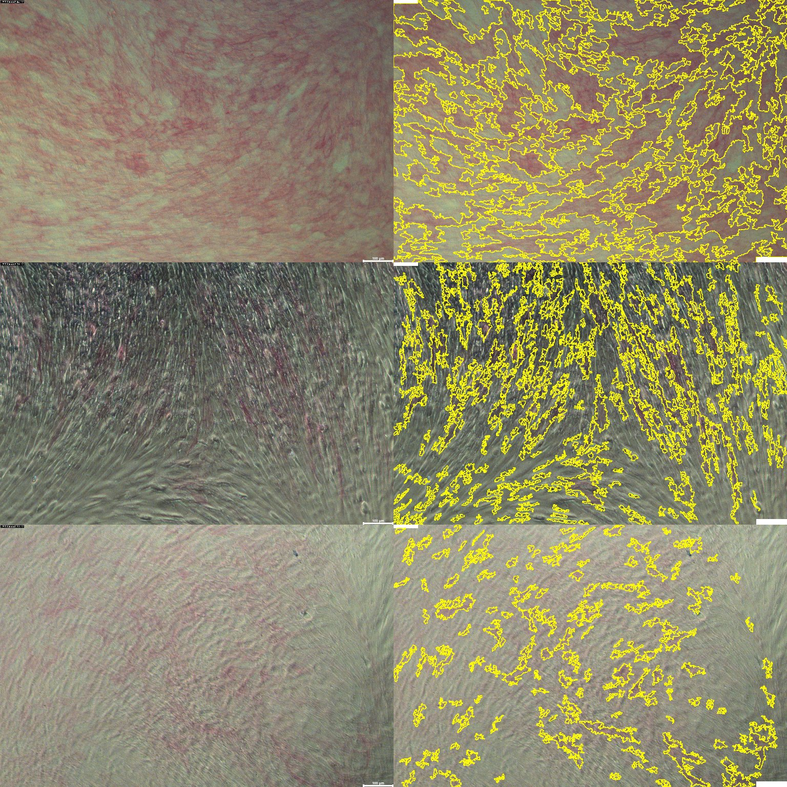

# IJ-Macro_Assisted-seg-histo-img
Assisted segmentation of histological images

## How does it work ?
1. When the macro is started, an image is assumed to be open. All images except the active image are closed and the ROI Manager, if present, is emptied.
2. The areas corresponding to the data label (top right) and the scale bar (bottom right) are filled in white to avoid these elements being detected as cells.
3. A duplicate of the image is created and named ‘Background’.
4. The image is subjected to a large Gaussian filter (sigma: 150 pixels): it is an estimator of illumination inhomogeneity.
5. The original image and the background image are transtyped from RGB to RGB stack. This operation allows the same operation to be performed simultaneously on all 3 channels.
6. The original image (its channels) is divided into the background image. As the result is in 32-bit format to preserve the precision of the calculation, it is renamed to NOM-ORIGINAL_IllumCorr and transtyped to 8-bit. This last step prepares the image for return in RGB (RGB = 3 8-bit channels). The original image is also re-typed in RGB.
7. A background correction using the rolling-ball method is applied to the image corrected for illumination (radius: 50 pixels) and then subjected to a median filter (radius: 5 pixels) to reduce the noise contribution.
8. A dialogue box appears, prompting the user to manually adjust the hue/saturation thresholds in order to identify the pixels carrying the marking.
9. A particle analysis is launched (filter size: 1000 pixels-infinite), resulting in a mask, the ROIs stored in the ROI Manager and a results table (Summary). The mask can be used if detections were to be missed. In this case:
10. Use a selection tool to crop the cell(s) on the original image.
  1. Recall the selection on the mask: activate the mask image then select Edit/Selection/Restore selection.
  2. Fill the selection with black (double-click on the dropper in the toolbar, then reset the foreground/background colours and select Image/Fill).
  3. The original image is activated and the ROIs are shown. A new image is created where the ROIs are drawn on the image copy (Flatten).
11. A dialog box appears allowing the user to specify the values used for segmentation. These values are logged in the ‘Summary’ table.

## How to use it ?
1. Drag and drop the macro file onto the ImageJ toolbar.
2. Open the image to be analysed.
3. In the macro window, select the Macro/Run macro menu.

Versions of the software used: Fiji, ImageJ 2.14.0/1.54f

## Repository content

|_Readme
|_[img](img/)
  |_[illustration](img/illustration/): stores images used in the readme
  |_[examples](img/examples/): example images used to build and test the macro
|_[macro](macro/): latest version of the macro
